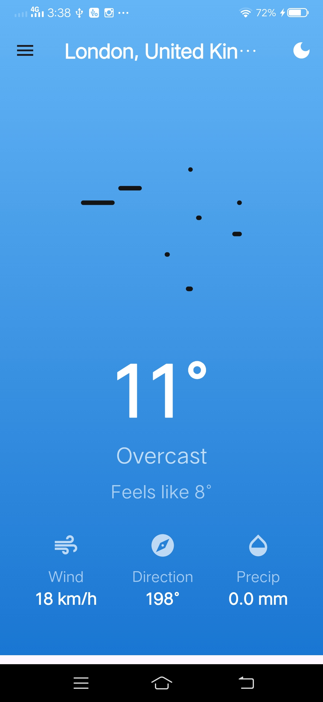
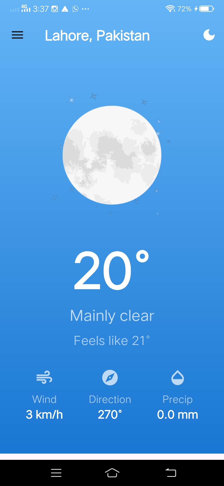
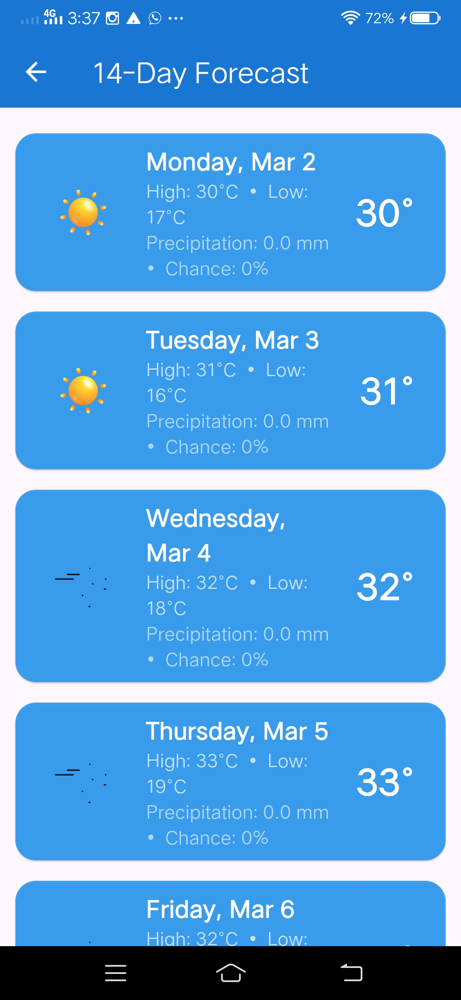
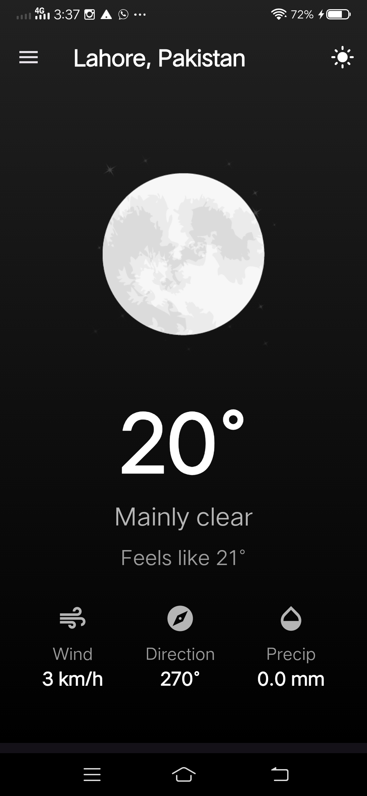
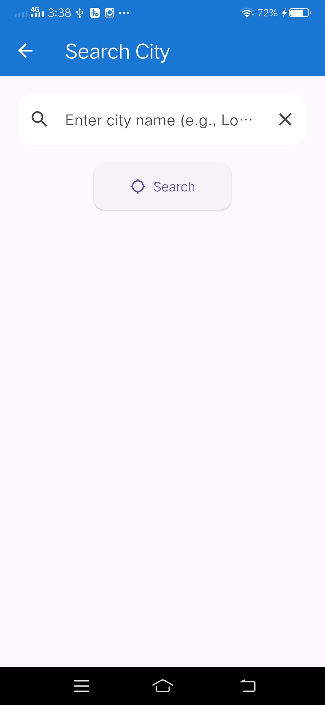
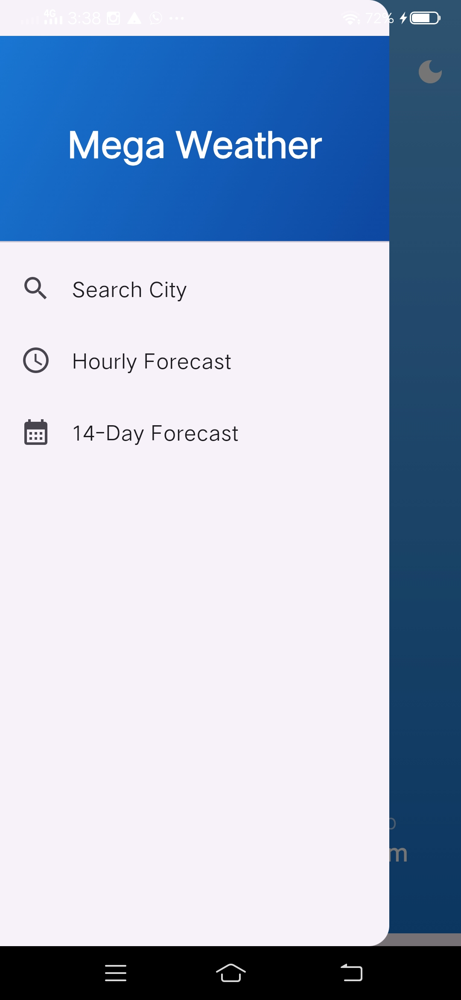
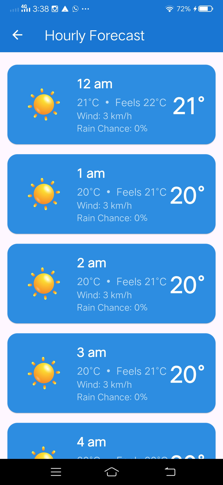

# 🌤️ MyWeather

A beautiful weather application built with **Flutter** for iOS and Android. MyWeather delivers real-time weather information with smooth Lottie animations and a clean, intuitive interface.

---

## ✨ Features

- 🌡️ Real-time current weather data
- 🎨 Beautiful Lottie animations for weather conditions
- 📱 Available on both Android and iOS
- 🌍 Location-based weather lookup
- 🌙 Clean and intuitive UI

---

## 📸 Screenshots

> _Add your app screenshots here_
>   
>  
>   
>   
>   
>   
>   


## 🛠️ Tech Stack

| Technology | Purpose |
|---|---|
| Flutter | Cross-platform UI framework |
| Dart | Programming language |
| Lottie | Weather condition animations |
| Weather API | Live weather data |

---

## 🚀 Getting Started

### Prerequisites

- [Flutter SDK](https://docs.flutter.dev/get-started/install) (v3.0 or higher)
- Dart SDK (comes with Flutter)
- Android Studio or Xcode (for iOS)
- An API key from a weather provider (e.g., [OpenWeatherMap](https://openweathermap.org/api))

### Installation

1. **Clone the repository**

   ```bash
   git clone https://github.com/Abd-ul-Hannan/myweather.git
   cd myweather
   ```

2. **Install dependencies**

   ```bash
   flutter pub get
   ```

3. **Configure your API key**

   Open the relevant file in `lib/` and replace the placeholder with your API key:

   ```dart
   const String apiKey = 'YOUR_API_KEY_HERE';
   ```

4. **Run the app**

   For Android:
   ```bash
   flutter run -d android
   ```

   For iOS:
   ```bash
   flutter run -d ios
   ```

---

## 📁 Project Structure

```
myweather/
├── android/          # Android platform files
├── ios/              # iOS platform files
├── assets/
│   └── lottie/       # Lottie animation files
├── lib/              # Main Dart source code
└── test/             # Unit and widget tests
```

---

## 🧪 Running Tests

```bash
flutter test
```

---

## 📦 Dependencies

See [`pubspec.yaml`](pubspec.yaml) for the full list of dependencies.

---

## 🤝 Contributing

Contributions are welcome! Feel free to open an issue or submit a pull request.

1. Fork the repository
2. Create your feature branch: `git checkout -b feature/my-feature`
3. Commit your changes: `git commit -m 'Add my feature'`
4. Push to the branch: `git push origin feature/my-feature`
5. Open a Pull Request

---

## 📄 License

This project is open source. See the [LICENSE](LICENSE) file for details.

---

## 👤 Author

**Abd-ul-Hannan**  
GitHub: [@Abd-ul-Hannan](https://github.com/Abd-ul-Hannan)

---

> Built with ❤️ using Flutter
